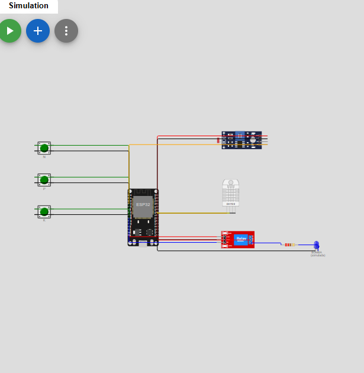

# FarmTech Solutions — irrigação simulada de alface

> **Estado do trabalho:** código compilado e circuito testado no Wokwi em 05/10/2026. Os arquivos, a captura do circuito e o vídeo de demonstração estão no [repositório GitHub público](https://github.com/Minhoquinha007/fiap-fase2-projeto2-irrigacao), acessível aos professores pelo link. Antes da entrega, ainda é necessário revisar a demonstração e enviar o link/arquivo solicitado no portal.

## Ideia em 1 minuto

O ESP32 acompanha uma **umidade simulada**, três estados binários de nutrientes (N, P e K) e um **pH simulado**. Quando a umidade cai abaixo de 45%, o programa aciona um relé azul que representa a bomba. Ao chegar a 55%, desliga. Entre 45% e 55%, conserva o estado anterior. O LED azul do circuito representa a bomba energizada, não uma bomba real.

Escolhi **alface** como cultura provisória. Os botões e o LDR são indicadores para diagnóstico e demonstração; **não bloqueiam a irrigação**. Essa separação evita concluir, sem uma medição confiável, que uma suposta deficiência de nutrientes ou um suposto pH inadequado seja motivo para deixar a planta sem água. A regra de acionamento é, portanto, baseada apenas na umidade simulada, como decisão de projeto.

## Componentes e ligações

| Peça no Wokwi | Papel no projeto | Ligação ao ESP32 |
| --- | --- | --- |
| Botão verde N | `1` quando pressionado; `0` quando solto | GPIO 13 e GND |
| Botão verde P | `1` quando pressionado; `0` quando solto | GPIO 14 e GND |
| Botão verde K | `1` quando pressionado; `0` quando solto | GPIO 27 e GND |
| LDR, saída `AO` | Valor analógico usado apenas para representar pH | GPIO 34; VCC 3V3; GND |
| DHT22, saída `SDA` | Umidade do ar usada apenas para representar umidade do solo | GPIO 18; VCC 3V3; GND |
| Módulo relé azul, entrada `IN` | Liga/desliga a bomba simulada | GPIO 26; VCC VIN; GND |
| LED azul e resistor de 220 Ω | Indicador visual da bomba, em série no contato `NO` do relé | `COM` do relé em 3V3; LED retorna ao GND |

Os botões usam `INPUT_PULLUP`: **pressionado = LOW no pino = 1 no Monitor Serial**. Para deixar mais de um botão pressionado no Wokwi, use Ctrl+clique em cada um; um clique posterior solta. Não existe leitura de concentração real de N, P ou K.

Arquivos do projeto: [`sketch.ino`](sketch.ino) (lógica C++), [`diagram.json`](diagram.json) (posições e fios no Wokwi) e [`libraries.txt`](libraries.txt) (biblioteca do DHT22).

## Como a decisão funciona

1. A cada 2 segundos, o programa lê os três botões, o LDR e o DHT22.
2. Calcula `pH_simulado = leitura_analogica × 14 / 4095` e exibe se está entre 6,0 e 6,8. Essa escala **não calibra um pH real**; apenas transforma a entrada analógica em um número de 0 a 14 para cumprir a simulação.
3. Se a umidade simulada for **menor que 45%**, liga a bomba. Se for **55% ou maior**, desliga. Entre esses valores, mantém o estado. Esse intervalo evita comutação a cada pequena oscilação da leitura.
4. Se o DHT22 retornar uma leitura inválida, desliga o relé preventivamente e informa `ERRO` no Monitor Serial.
5. O Monitor Serial exibe N, P, K, valor bruto do LDR, pH simulado, umidade simulada e estado da bomba.

| Situação de exemplo | Estado esperado |
| --- | --- |
| Início com 60% de umidade | Bomba desligada |
| Reduzir para 40% | Bomba ligada; LED azul aceso |
| Aumentar para 50% depois de ligar | Continua ligada |
| Aumentar para 56% | Bomba desligada; LED azul apagado |
| Reduzir para 50% depois de desligar | Continua desligada |

Os valores **45% e 55% são parâmetros didáticos escolhidos para testar o programa**. Eles **não são recomendação agronômica** para alface. O DHT22 mede umidade relativa **do ar**, não teor de água no solo; por isso, a porcentagem exibida não deve ser interpretada como medição de uma lavoura.

### Relação com a alface e limites do modelo

A escolha do intervalo de **pH 6,0–6,8** para mostrar um diagnóstico foi inspirada na publicação [*Cultura da Alface*, capítulo 4, do Incaper](https://biblioteca.incaper.es.gov.br/digital/handle/item/4195). Isso **não transforma o LDR em pHmetro**. Luz e pH são grandezas diferentes, sem conversão física pelo cálculo acima. Da mesma forma, os botões não medem fertilidade: uma adubação real de N, P e K dependeria de análise do solo e recomendações para a cultura.

Ao demonstrar uma mudança de N, P ou K, **ajuste manualmente também o controle do LDR** para representar um novo cenário, conforme solicitado no enunciado. O código **não faz o botão alterar automaticamente o pH**, pois isso fingiria uma relação causal que a simulação não mede.

## Como abrir e testar no Wokwi

1. Crie um projeto **ESP32** em [Wokwi](https://wokwi.com/projects/new/esp32).
2. Substitua o conteúdo de `sketch.ino` e `diagram.json` pelos arquivos deste diretório. Adicione `libraries.txt` com a linha presente aqui.
3. Inicie a simulação e abra o **Monitor Serial**. A umidade inicial do DHT22 é 60%, então a bomba deve iniciar desligada.
4. Clique no DHT22 e mova o controle de umidade para 40%, espere cerca de 2 segundos e confira `BOMBA=ON` e LED azul aceso. Depois use 50% e 56% para testar a histerese.
5. Pressione N, P e K separadamente e confira `0/1` no Monitor Serial. Altere a iluminação do LDR e observe o valor do pH simulado. Faça também um cenário combinado, mudando botões **e** LDR manualmente.
6. Confira visualmente que o LED no contato `NO` do relé está **aceso apenas com `BOMBA=ON`**. Na simulação deste circuito com `transistor: "npn"`, foi necessário usar `HIGH` como nível ativo. A documentação atual do Wokwi apresenta descrições contraditórias sobre a polaridade; se trocar o módulo ou usar hardware real, **verifique a polaridade novamente** antes de acionar uma bomba.

### Testes executados em 05/10/2026

O código compilou no Wokwi com a biblioteca `DHT sensor library for ESPx`. O Monitor Serial e o LED mostraram:

| Entrada | Resultado observado |
| --- | --- |
| Umidade simulada 56% | `BOMBA=OFF`; LED apagado |
| Redução para 40% | `BOMBA=ON`; LED aceso |
| Aumento para 50% após 40% | Permaneceu `ON` |
| Aumento para 56% | Passou a `OFF`; LED apagado |
| Redução para 50% após 56% | Permaneceu `OFF` |
| N, P e K pressionados com Ctrl+clique | `N=1 P=1 K=1` |
| LDR ajustado manualmente de 500 lux para cerca de 132 lux | `pH_SIM` mudou de 3,42 para 6,32 |

O cenário de **leitura inválida do DHT22** tem desligamento programado, mas ainda não foi provocado e observado na interface do simulador.

### Captura do circuito no Wokwi

As conexões de cada componente são detalhadas na tabela acima e no arquivo [`diagram.json`](diagram.json). A captura documenta o circuito; os estados de irrigação são demonstrados pelos testes e pelo vídeo de entrega.

## Evidências e publicação

- [x] Executar e validar os cenários principais no Wokwi. **O enunciado recebido não exige link do Wokwi**; os arquivos locais permitem remontar a simulação.
- [x] Inserir neste README a imagem real das conexões do Wokwi.
- [x] Publicar os arquivos de texto em um repositório GitHub: [Minhoquinha007/fiap-fase2-projeto2-irrigacao](https://github.com/Minhoquinha007/fiap-fase2-projeto2-irrigacao).
- [x] Tornar o repositório público para que os professores consigam acessá-lo pelo link (visibilidade confirmada em 09/10/2026).
- [x] [Vídeo de demonstração no YouTube](https://youtu.be/WpW4bNwpo0I), **não listado**, duração **3 min 47 s** (visibilidade e duração conferidas em 09/10/2026).
- [ ] Fazer uma revisão final do vídeo antes da entrega: confirmar que o áudio e a tela mostram com clareza o circuito, os botões/LDR/DHT22 e o relé ligando e desligando.
- [ ] Verificar no portal qual arquivo ou link deve ser enviado; conferir antes do envio e não deixar para os últimos minutos.
- [ ] Após a data de entrega no portal, **não alterar o repositório**, conforme a instrução do enunciado.

O trabalho permite grupo de **1 a 5 estudantes**; este protótipo foi organizado para execução individual. As extensões com API meteorológica em Python e análise em R são **opcionais** e não foram implementadas, para priorizar a parte obrigatória dos quatro trabalhos do período.

## Referências técnicas

- [Wokwi — formato de `diagram.json`](https://docs.wokwi.com/diagram-format)
- [Wokwi — ESP32](https://docs.wokwi.com/parts/wokwi-esp32-devkit-v1), [DHT22](https://docs.wokwi.com/parts/wokwi-dht22), [LDR](https://docs.wokwi.com/parts/wokwi-photoresistor-sensor), [botão](https://docs.wokwi.com/parts/wokwi-pushbutton) e [módulo relé](https://docs.wokwi.com/parts/wokwi-relay-module)
- [Espressif — leitura analógica no Arduino-ESP32](https://docs.espressif.com/projects/arduino-esp32/en/latest/api/adc.html)
- [Incaper — *Cultura da Alface*, capítulo 4](https://biblioteca.incaper.es.gov.br/digital/handle/item/4195)

